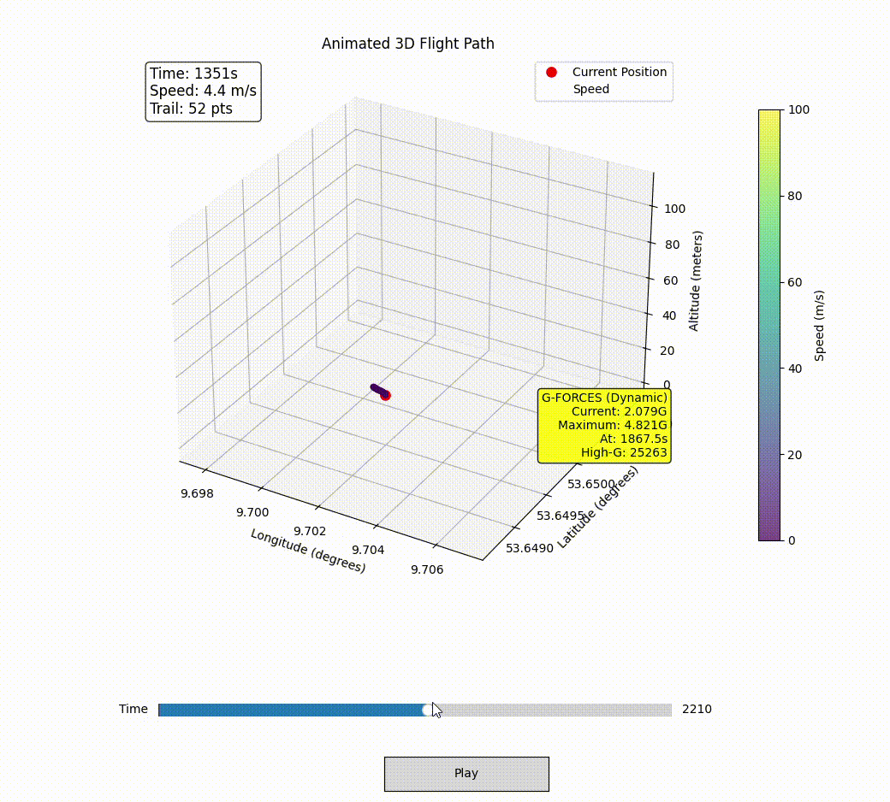

# 3D Flight Viewer

An interactive 3D flight path visualization tool that displays animated aircraft flight paths with real-time attitude data, G-force analysis, and speed visualization. [Example video is shot using "flight6.CSV"]



## Features

- **Interactive 3D Animation**: Real-time flight path with speed-colored trail
- **Flight Controls**: Play/pause, time slider for navigation
- **Attitude Analysis**: Roll, pitch, yaw calculations with aviation standards
- **G-Force Monitoring**: Dynamic G-force analysis with high-G event detection
- **Multiple Data Sources**: Support for various flight data formats
- **Click Interaction**: Click on flight path to view detailed flight parameters

## Prerequisites

### Required Software
- **Python 3.7+** (recommended: Python 3.9 or newer)
- **IDE Options** (any of these work well):
  - Visual Studio Code
  - PyCharm
  - Windsurf IDE
  - Jupyter Notebook
  - Any Python-compatible IDE

### Dependencies
Install the required Python packages:

```bash
pip install -r requirements.txt
```

**Required packages:**
- `pandas>=1.3.0` - Data manipulation and analysis
- `numpy>=1.20.0` - Numerical computations
- `matplotlib>=3.3.0` - 3D plotting and animation
- `openpyxl>=3.0.0` - Excel file support
- `pyglet>=1.5.0` - Graphics library

## Installation

1. **Clone or download** the flight_viewer directory
2. **Navigate to the flight_viewer folder** in your terminal/command prompt
3. **Install dependencies:**
   ```bash
   pip install -r requirements.txt
   ```

## Usage

### Basic Usage (Default Flight)
```bash
python animated_3d_viewer.py
```
This runs the default flight data (`ATA-Flight2.CSV`).

### Run Specific Flight Files
You can specify different flight files by adding the filename:

```bash
python animated_3d_viewer.py [filename.CSV]
```

### Available Example Flights
The following flight files are included:

```bash
# Team flights
python animated_3d_viewer.py flight1.CSV      # Default
python animated_3d_viewer.py flight2.CSV
python animated_3d_viewer.py flight3.CSV
python animated_3d_viewer.py flight4.CSV
python animated_3d_viewer.py flight5.CSV
python animated_3d_viewer.py flight6.CSV
```

## Required CSV Format

Your flight data CSV must contain these columns:
- `timestamp` - Time in milliseconds
- `latitude` - GPS latitude in degrees
- `longitude` - GPS longitude in degrees
- `altitude` or `gpsAltitude` - Altitude in meters

**Optional columns for enhanced features:**
- `accX`, `accY`, `accZ` - Accelerometer data (G-units)
- `gyroX`, `gyroY`, `gyroZ` - Gyroscope data (degrees/second)

## Controls

### Animation Controls
- **Play/Pause Button** - Start/stop the animation
- **Time Slider** - Drag to jump to any point in the flight
- **Mouse Click** - Click on flight path points to view detailed data

### Keyboard Shortcuts
- **Close Window** - End the visualization

## Flight Data Display

The viewer shows:
- **Current Position** - Red marker showing aircraft location
- **Speed Trail** - Color-coded trail (51 points) showing recent flight path
  - Blue/Purple = Slower speeds
  - Green/Yellow = Medium speeds  
  - Red = Higher speeds
- **Flight Info Panel** - Current time, speed, and trail length
- **G-Force Panel** - Real-time and maximum G-force data
- **Clickable Points** - Click any trail point for detailed flight parameters

## Performance Features

- **3x Speed Animation** - Fast playback through flight data
- **Optimized Rendering** - Reduced lag with efficient trail rendering
- **Smart Data Sampling** - Shows every 6th data point for smooth performance

## Troubleshooting

### File Not Found
```
Error: File 'filename.CSV' not found.
```
- Ensure you're running the command from the `flight_viewer` directory
- Check that the CSV file exists in the same folder
- Use the exact filename (case-sensitive)

### Missing Columns
The program will show available columns if required ones are missing:
```
Available columns: ['col1', 'col2', ...]
Missing required column 'latitude'. Looked for: ['latitude']
```

### Performance Issues
- Close other applications to free up system resources
- Try a smaller flight file for testing
- Ensure your graphics drivers are up to date

## File Structure

```
flight_viewer/
├── animated_3d_viewer.py    # Main application
├── data_loader.py           # CSV/Excel file reading
├── requirements.txt         # Python dependencies
├── README.md                # This documentation
├── flight1.CSV              # Default flight data
├── flight2.CSV              # Example flight files
├── flight3.CSV              # ...
├── flight4.CSV              # ...
├── flight5.CSV              # ...
├── flight6.CSV              # ...
└── [other flight files]     # Additional examples
```

## Example Commands

```bash
# Run with default settings
python animated_3d_viewer.py

# Run specific team flights
python animated_3d_viewer.py Team6-Flight2.CSV
python animated_3d_viewer.py NPU_Flight1.CSV

# Run your own flight data
python animated_3d_viewer.py my_flight_data.CSV
```

## Technical Details

- **Coordinate System**: Uses GPS coordinates (latitude, longitude, altitude)
- **Animation Speed**: 3x real-time with 8ms frame intervals
- **Trail Length**: 51 points with speed-based coloring
- **Attitude Calculation**: Team 0 configuration with aviation standards
- **G-Force Analysis**: Dynamic G-force with gravity compensation
