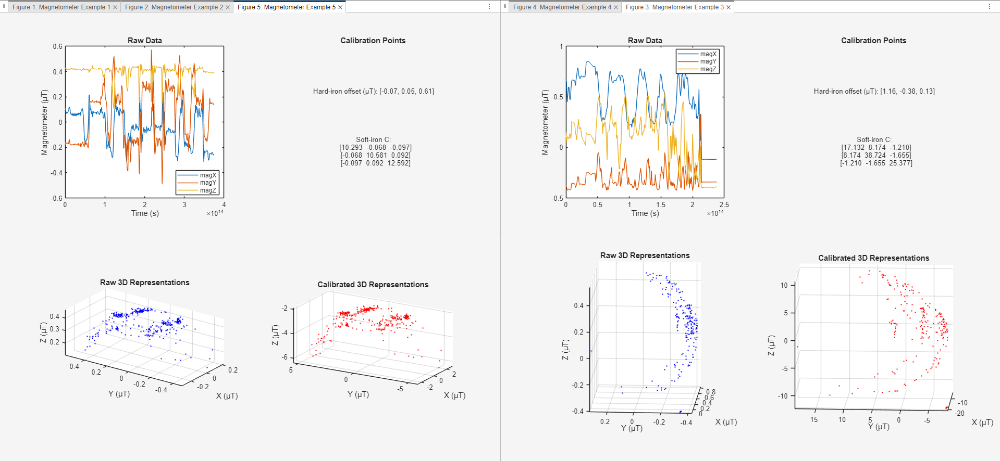

# Application of a Kalman Filter for robustness and precision

The following program can be obtained running "A00_Kalman_Filter_Offline.m". It takes sample data from existing flights, without initial calibrations. The initial idea was an on-flight filtering.

