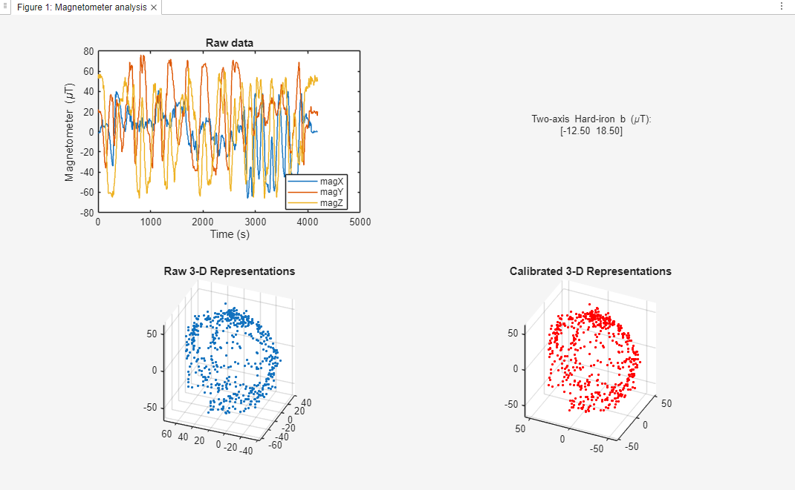

## Two Axis Calibration

This method executes only an XY hard-iron calibration. Hard-iron offsets are the main source of error, and leaving the Z axis uncalibrated affects the error margin of Yaw.

# Procedure

1. Place the datalogger inside the plane.
2. Slowly rotate the aircraft 360° in a flat surface (or by hand) for ~30 seconds.

# Results

Yaw error margin: -+ 9°

Skipping the two-axis magnetometer calibration, on the other hand, would lead to yaw errors of -+ 15-30°

# Analysis of the Screenshot

This method correct XY offsets. Even though the Z looks calibrated as well, that is mainly because there were no significant Z offsets during this measurements (this is not likely to be the case during the competition).

