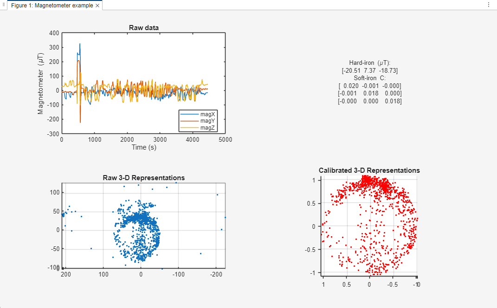

# Application of a Kalman Filter for robustness and precision

The following program can be obtained running "A00_Kalman_Filter_TXTs.m", part of the project "01 Final Analysis \ 00 Ideal Spherical Calibration". It includes hard-iron and soft-iron corrections, and accounts for severe magnetic field spikes possibly caused by temporary surrounding objects.

The data used to make the analysis is transferred directly from the USB powering the Arduino, and captured through a simple Windows PowerShell program, "00_ReadUSB_toTxt.ps1". The .ino file is also adapted for this purpose and all necessary files can be found in the folder "02 General Purpose Programs".

# Suggested Calibration Procedure

The most realistic and somewhat accurate calibrations are rather the complicated Six-Axis Calibration or the Two-Axis Calibration. The latter still leads to fairly accurate measurements, and is advisable for the competition if "yaw" isn't a critical quantity.
