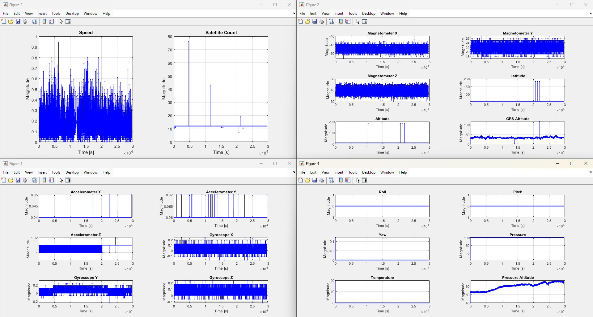
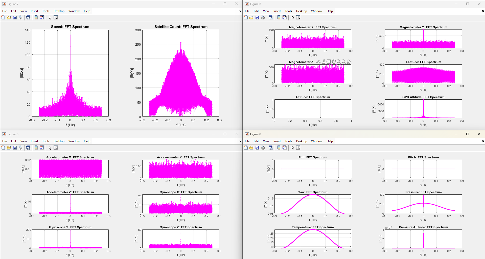

# MATLAB Simulation Results

The following data can be obtained running the main program 'A02_Multiple_SensorData_Analysis'. All other files are functions and must be inside the same folder (including Excel sheet).

## 📌 Original Signals

Below are the unmodified signals, recorded for 8hs without movement (stationary data collection).

## 📌 Fourier Transforms of the signals

